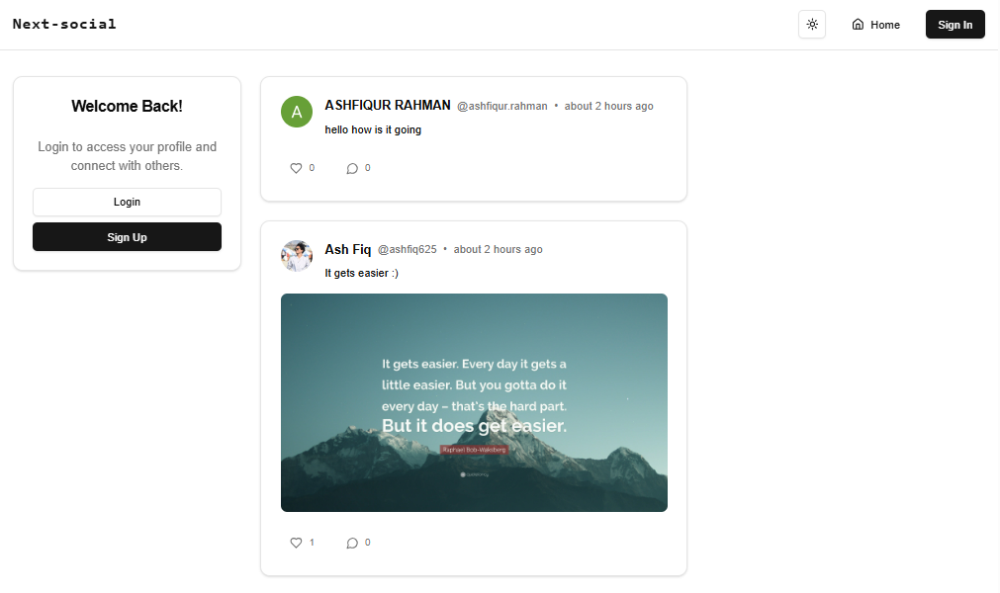
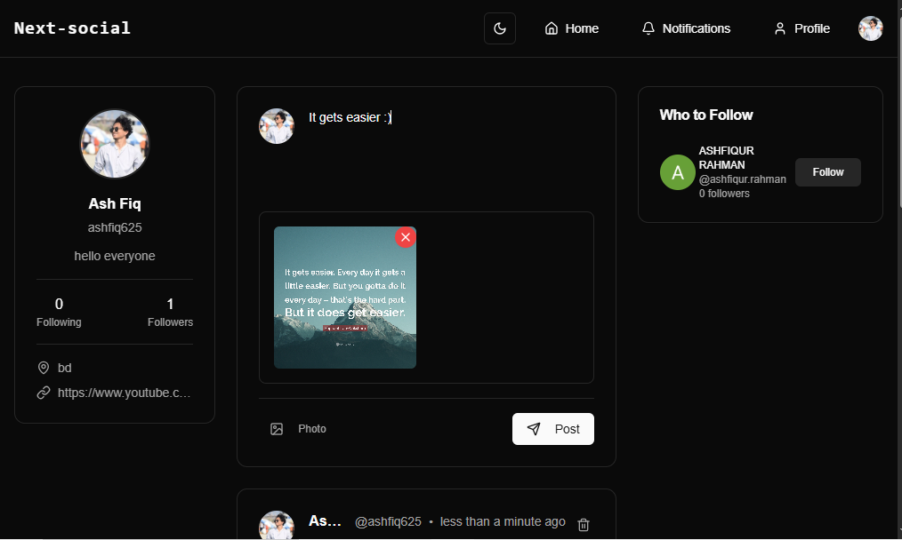
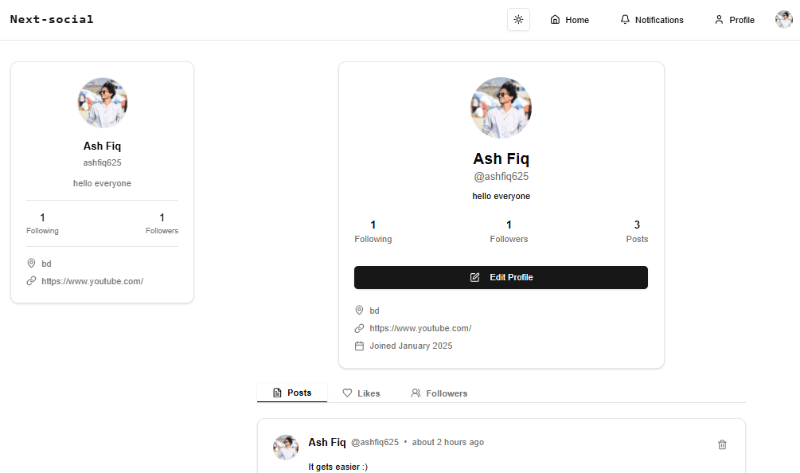

# NextSocial — Full-Stack Social Media Platform

## Overview

**NextSocial** is a full-stack social media web application built with **Next.js 14** that implements core social networking features such as authentication, user interactions, content sharing, and real-time UI updates. The project focuses on clean architecture, modern tooling, and production-ready patterns commonly used in real-world applications.

This project was built to demonstrate practical experience with **Next.js App Router**, authentication workflows, database modeling, and scalable frontend design.

---

## Key Features

- User authentication and session management using **Clerk**
- Create posts with image uploads
- Like and comment on posts
- Follow and unfollow users
- Personalized feed based on user relationships
- Responsive UI with dark/light theme support
- Secure and scalable PostgreSQL database hosted on **Neon**
- Type-safe database access using **Prisma ORM**

---

## Tech Stack

### Frontend

- **Next.js 14** (App Router)
- **React 18**
- **TypeScript**
- **Tailwind CSS**
- **Radix UI**
- **Lucide Icons**
- **next-themes** for dark/light mode

### Backend

- **Next.js Server Actions & API Routes**
- **Prisma ORM**
- **PostgreSQL (Neon)**

### Authentication & Uploads

- **Clerk** for authentication and user management
- **UploadThing** for image uploads

---

## Architecture Overview

- Uses **Next.js App Router** for routing and layouts
- Server components are used where possible to reduce client-side overhead
- Client components are isolated for interactivity (likes, comments, follows)
- Prisma handles database access with generated types for safety
- Authentication logic is abstracted using Clerk middleware
- Environment variables are used for secrets and database credentials

---

## Database

- **PostgreSQL**, hosted on **Neon**
- Managed using **Prisma**
- Relationships include:
  - Users
  - Posts
  - Likes
  - Comments
  - Followers / Following

Prisma client is automatically generated on install using:

```bash
npm install
```

---

## find this app here: https://next-social-1td5.onrender.com

## Getting Started

### Prerequisites

- Node.js 18+
- npm or yarn
- PostgreSQL database (Neon recommended)

---

### Installation

```bash
git clone https://github.com/your-fiqash/next-social.git
cd next-social
npm install
```

---

### Environment Variables

Create a `.env` file and configure the following:

```env
DATABASE_URL=your_neon_database_url
NEXT_PUBLIC_CLERK_PUBLISHABLE_KEY=your_clerk_key
CLERK_SECRET_KEY=your_clerk_secret
UPLOADTHING_TOKEN=your_uploadthing_token

```

---

### Running the App

```bash
npm run dev
```

The app will be available at:

```
http://localhost:3000
```

---

<<<<<<< HEAD
## Scripts

| Script          | Description              |
| --------------- | ------------------------ |
| `npm run dev`   | Start development server |
| `npm run build` | Build for production     |
| `npm start`     | Run production build     |
| `npm run lint`  | Lint the project         |

---

## What This Project Demonstrates

- Real-world authentication flows with third-party providers
- Handling relational data in a social graph (followers, likes, comments)
- Secure file uploads in a modern React application
- Clean separation between UI, business logic, and data access
- Practical experience with production-grade Next.js patterns

---

## Demo Screenshots

### User Feed



### Create Post



### Profile



## Future Improvements

- Real-time notifications
- Infinite scrolling feed
- User profile customization
- Content moderation and reporting
- Performance optimizations with caching

---

## Author

**Ash Fiq**
Full-Stack Web Developer
GitHub: [https://github.com/fiqash]

---
=======


>>>>>>> fdc0f2f1df2bab8aeedfa2c233cb284aa9f83342
